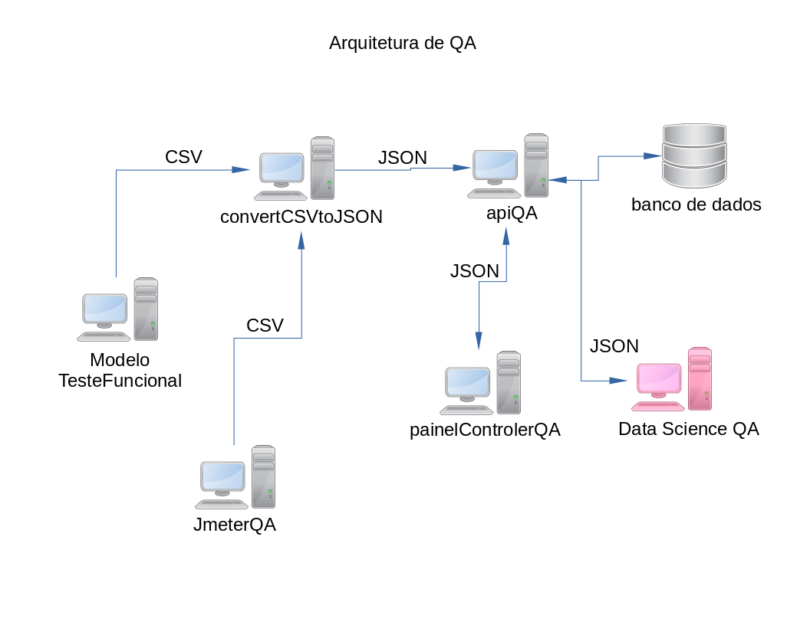

# dataScienceQA

> Painel Teste, faz parte de arquitetura de sistema para testa sistemas web. 
 
> Versão 04 - atualizado 25 / Jun / 2020

> ** Ferramentas de desenvolvimento **  
> Python 3

# URL para acessar API
> Acesse http://localhost:8080/api/clientes

# Links dos projetos da arquitetura
> __Modelo Teste Funcional__
> [GitHub Pages](https://github.com/marcosregato/modeloTesteFuncional). 

> __Painel Teste Angular__
> [GitHub Pages](https://github.com/marcosregato/painelTesteAngular). 

> __Api Teste MongoDB__
> [GitHub Pages](https://github.com/marcosregato/apiTesteMongoDB). 

> __convert CSV to JSON__
> [GitHub Pages](https://github.com/marcosregato/convertCSVtoJSON). 
